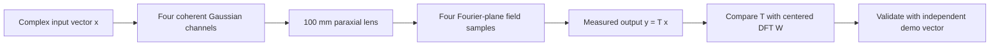

# Coherent Optical DFT Matrix Multiplier

**A four-channel Fourier-optics system that computes a centered 4-point DFT.** The optical model is built in Ansys Zemax OpticStudio Student; Python generates the coherent input beams and reconstructs the measured transfer matrix from Physical Optics Propagation (POP) output.

[Results](#measured-result) · [Method](#how-it-works) · [Reproduction guide](docs/REPRODUCING.md) · [OpticStudio lens](zemax/optical_matrix_4x4.zmx)


*Demo-vector irradiance from Zemax POP. Dashed lines mark the four output-channel sample positions.*

## Measured result

| Metric | Result |
|---|---:|
| Transfer-matrix normalized Frobenius error | **4.61%** |
| Transfer-matrix phase RMSE | **2.64°** |
| Independent demo-vector normalized L2 error | **0.78%** |
| Largest absolute matrix-entry error | **0.0414** |

The matrix error compares the four basis-beam measurements to the analytic DFT after fitting one global complex scale to the whole matrix. The demo check uses that same calibration, then corrects a unit-magnitude global phase offset between separate POP runs. No demo amplitude was fitted. Without phase alignment, the demo complex error is 117.6%; this exposes the different POP pilot-beam phase reference.

These are simulated results from five POP runs at 1024 × 1024 input sampling in OpticStudio Student. This project does not include a physical optical bench.

## How it works

Four spatially separated Gaussian beams encode the complex input vector \(\mathbf{x}\). Their weighted coherent sum passes through an ideal paraxial lens. At the focal plane, four complex-field samples form the output vector \(\mathbf{y}=T\mathbf{x}\).



The target transform is

\[
W_{mn}=\frac{1}{2}\exp\!\left(s\,i\frac{2\pi}{4}(m-1.5)(n-1.5)\right),
\qquad m,n\in\{0,1,2,3\},\quad s=+1.
\]

The centered convention determines the four output positions. With 632.8 nm light, a 100 mm focal length, and 0.25 mm channel pitch, they are approximately **−94.92, −31.64, +31.64, and +94.92 µm** along x.

### Optical setup

| Element | Model |
|---|---|
| Input | Four Gaussian channels at x = −0.375, −0.125, +0.125, +0.375 mm; 30 µm radius |
| Fourier optic | Ideal paraxial lens, f = 100 mm; 10 mm entrance pupil; lens is the aperture stop |
| Propagation | 100 mm from input plane to lens; 100 mm from lens to image plane |
| Output | Complex Ex sampled in a 10 µm × 10 µm window at each DFT location |

The saved OpticStudio lens is [`zemax/optical_matrix_4x4.zmx`](zemax/optical_matrix_4x4.zmx); [`zemax/prescription.csv`](zemax/prescription.csv) summarizes its four surfaces.

## Results at a glance

### Transfer matrix


### Independent input check


Full numeric metrics are in [`results/metrics.json`](results/metrics.json). Readable target, raw, and calibrated matrices are in [`results/matrices/`](results/matrices/).

## Reproduce

Python handles beam generation, ZBF file I/O, field extraction, calibration, and plots. OpticStudio POP runs are performed in its GUI.

```powershell
python -m venv .venv
.venv\Scripts\Activate.ps1
python -m pip install -r requirements.txt
python scripts/generate_inputs.py
```

Then copy inputs to the installation's POP beam folder, run the five specified POP jobs, and place their output beams in `data/output/`:

```powershell
python scripts/copy_to_zemax.py --pop-dir "C:\path\to\Zemax\POP"
python scripts/analyze_results.py
```

See [`docs/REPRODUCING.md`](docs/REPRODUCING.md) for POP settings, exact filenames, and result details. Run the Python unit tests with `python -m pytest`.

Raw input and output ZBF beams are ignored by Git; each five-beam set is about 80 MiB. The input generator recreates the inputs, and the five POP runs recreate the outputs. Tracked metrics, matrices, checksums, and selected figures preserve the measured result.

## Repository map

```text
config/                 Optical, sampling, and analysis parameters
src/optical_mvm/        ZBF I/O, input fields, DFT theory, extraction, plots
scripts/                Generate, inspect, transfer, and analyze beam files
data/input/manifest.csv Inputs and corresponding POP output filenames
docs/REPRODUCING.md     OpticStudio POP workflow and validation record
docs/images/            OpticStudio screenshots and selected result figures
zemax/                  Validated lens file and surface table
results/                Measured metrics and readable matrix/vector data
tests/                  Unit tests for coordinates, theory, and ZBF I/O
```

## Scope and limitations

- Implements one fixed centered 4-point DFT, not a general programmable 4 × 4 matrix.
- Uses an ideal paraxial lens; lens aberrations, fabrication tolerances, alignment drift, and polarization effects are outside this baseline.
- The continuous Fourier-plane field is represented by four finite-area samples. Finite beam width and extraction windows contribute to the measured error.
- The reported result depends on the checked-in configuration and the OpticStudio POP settings documented in the reproduction guide.
