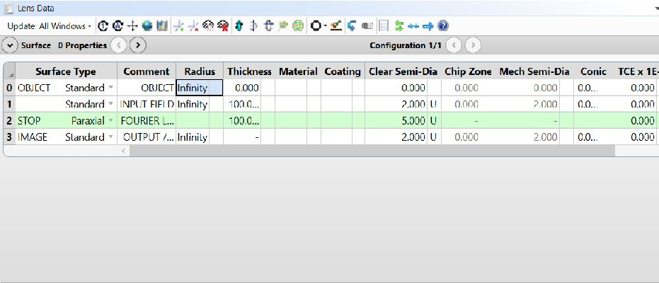
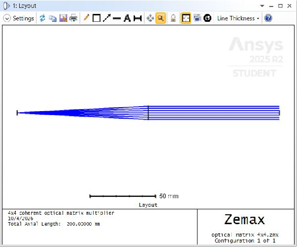
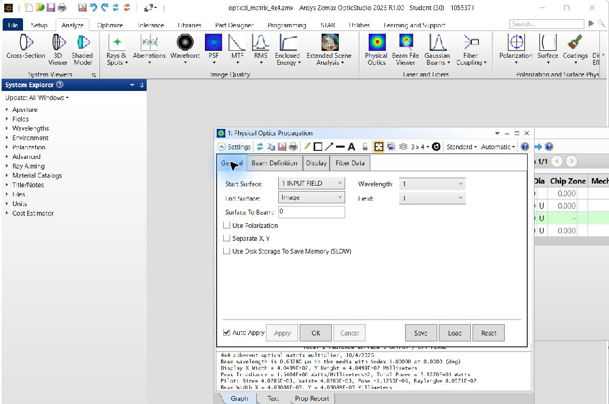
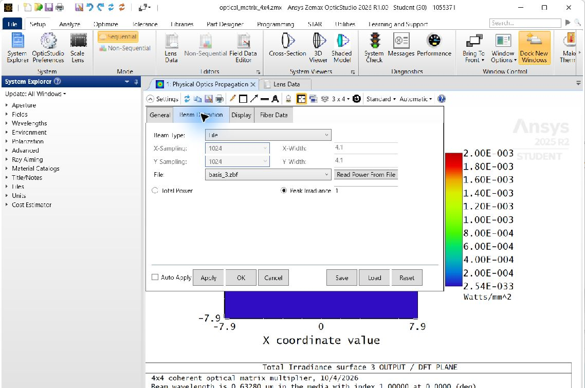
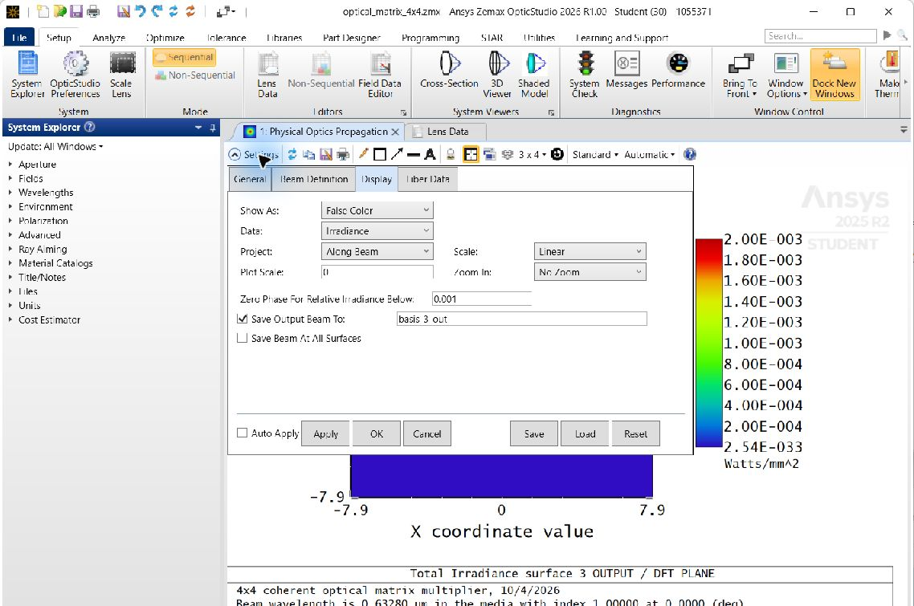
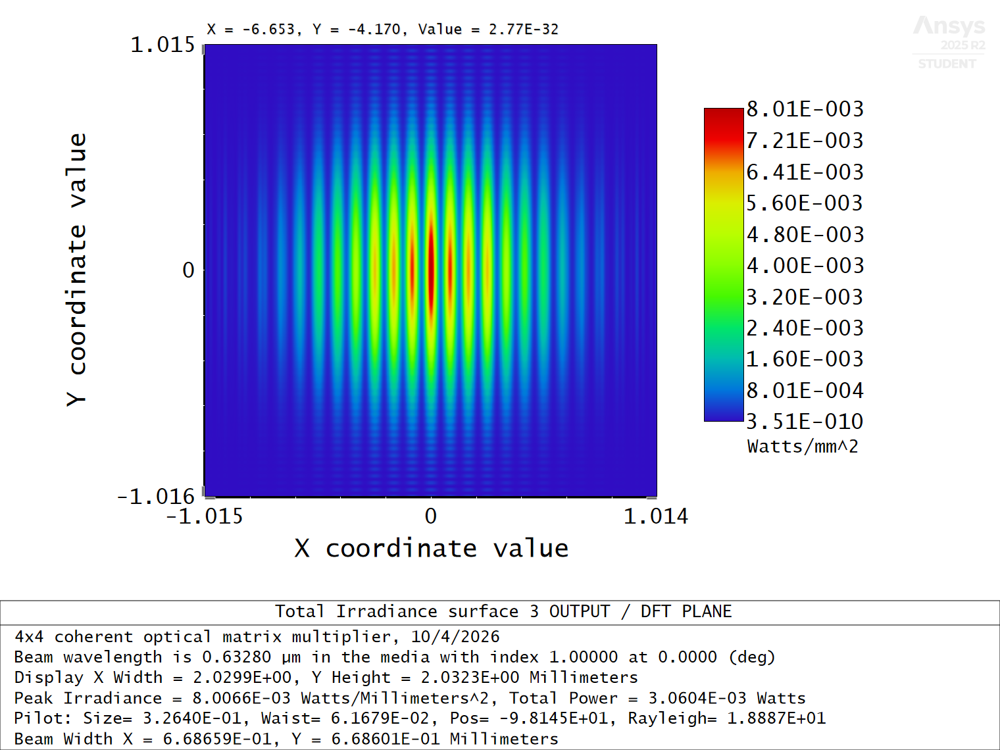
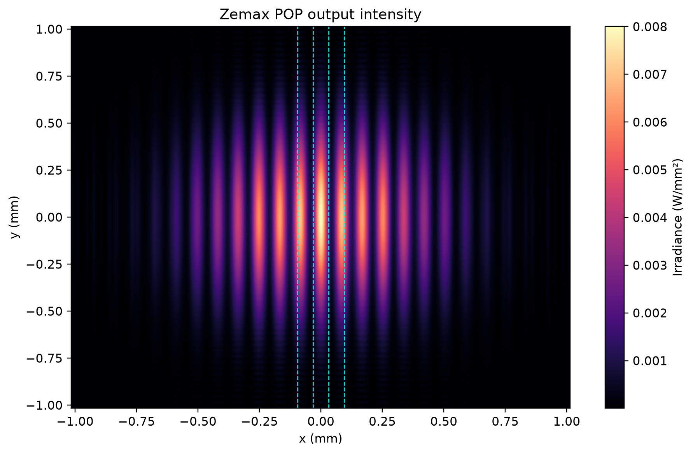
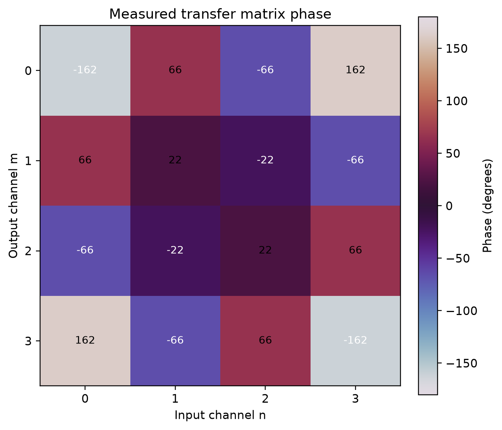
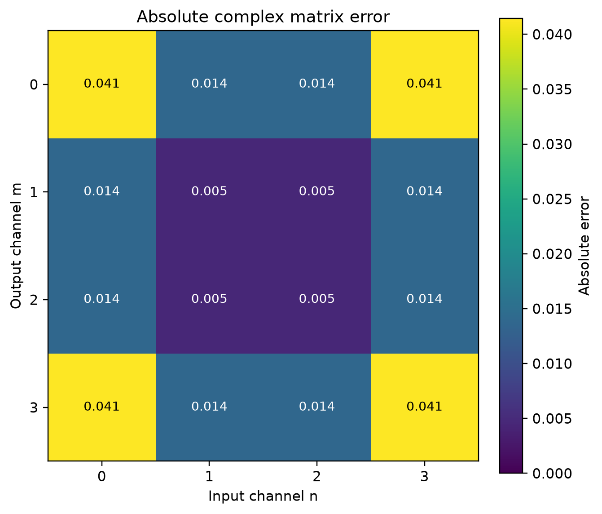
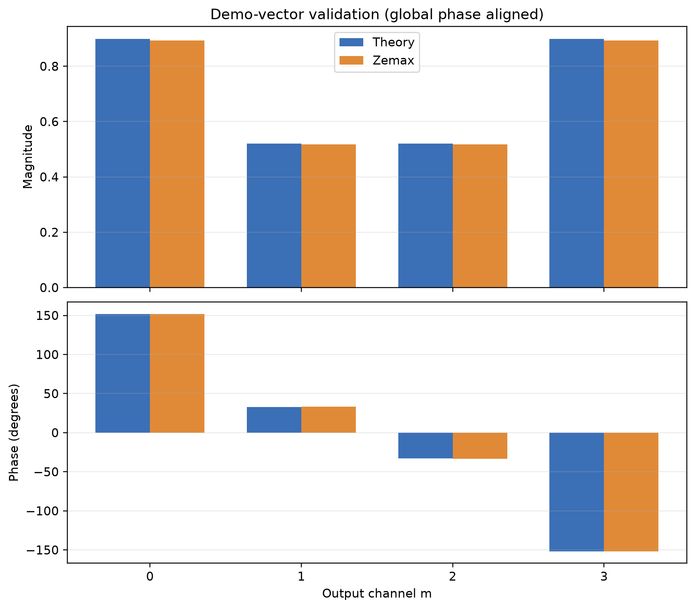

# 4×4 Coherent Optical Matrix Multiplier

Portfolio project: model, propagate, and measure a four-channel coherent optical transform with Ansys Zemax OpticStudio Student and Python. The optical operation is a centered four-point DFT:

\[
\mathbf y = W\mathbf x.
\]

Four spatially separated Gaussian beams encode the complex components of `x`. An ideal paraxial lens performs a spatial Fourier transform. The complex field is sampled at four focal-plane locations to recover the four values in `y`. This architecture implements one specific matrix—the DFT—not an arbitrary dense matrix.

## Physical principle

The input field is the coherent sum

\[
E(x,y)=\sum_{n=0}^{3}x_n\exp\!\left[-\frac{(x-x_n)^2+(y-y_n)^2}{w_0^2}\right].
\]

The coefficient of each spatial channel is a complex amplitude. Negative and complex coefficients encode phase directly; for example, a negative real input introduces a π phase shift. At the back focal plane, a lens maps transverse spatial frequencies to position. Sampling at the four centered DFT frequencies yields the matrix-vector product, up to the known Gaussian envelope, one global optical scale, and numerical POP error.

## Why the system implements a matrix multiplication

Fourier propagation is linear, and the input field is a weighted sum of four basis fields. Therefore each output sample is a sum of four basis responses weighted by the corresponding input coefficients:

\[
y_m=\sum_{n=0}^{3}T_{mn}x_n.
\]

The four basis-beam POP runs measure the columns of `T`. In the ideal paraxial setup, those responses form the centered DFT matrix `W`. The fifth, demo-vector run checks that the calibrated matrix predicts a new input vector. This is a DFT implementation, not an arbitrary dense matrix.

The analytical matrix uses

\[
W_{mn}=\frac{1}{2}\exp\!\left[s\,i\frac{2\pi}{4}(m-1.5)(n-1.5)\right],\quad s=+1.
\]

The `−1` convention is also evaluated as a diagnostic. The five OpticStudio runs favored `+1`; analysis reports both sign scores and never changes sign or conjugates data automatically.

## Optical prescription

The Sequential model has an input plane, 100 mm propagation, a 100 mm focal-length ideal paraxial lens, then another 100 mm propagation to the Fourier/output plane. The lens is the aperture stop. Wavelength is 632.8 nm; entrance pupil is 10 mm. The generated starter prescription is [`zemax/optical_matrix_4x4.zmx`](zemax/optical_matrix_4x4.zmx). Full surface table and GUI setup are in [`zemax/PRESCRIPTION.md`](zemax/PRESCRIPTION.md), with a machine-readable summary in [`zemax/prescription.csv`](zemax/prescription.csv).

### OpticStudio model

The prescription was opened and saved in OpticStudio Student 2026 R1. The Lens Data Editor shows the input plane, paraxial stop, and image plane:



The sequential layout shows 100 mm from input to lens and 100 mm from lens to output:



## Student-edition constraints

> The project was deliberately designed around the limitations of Ansys Zemax OpticStudio Student. The Student edition does not support ZPL, ZOS-API, user-defined DLLs, or Non-Sequential Mode. Therefore Python handles beam generation and data analysis using the documented Zemax Beam File format, while Physical Optics Propagation is executed manually in Sequential Mode.

Ansys currently also lists one simultaneous OpticStudio instance and up to four CPU cores for Student. The project scripts use files on disk; POP setup and propagation happen in the GUI. See [Ansys Student edition limits](https://www.ansys.com/en-in/academic/students/ansys-student).

## Installation

Target Python 3.11+.

```bash
python -m venv .venv
# Windows PowerShell
.venv\Scripts\Activate.ps1
python -m pip install -r requirements.txt
```

Dependencies: NumPy, SciPy, Matplotlib, PyYAML, pandas, pytest. No ZOS-API, ZPL, COM, pythonnet, MATLAB, or Zemax Python package is required. Project values live in [`config/project.yaml`](config/project.yaml). Set `sampling.nx` and `sampling.ny` to 512, 1024, or 2048 for convergence studies; input dimensions must remain powers of two.

## Generate the optical inputs

```bash
python scripts/generate_inputs.py
```

Creates four normalized basis beams and one demo beam as binary version-1 `.ZBF` files, plus `data/input/manifest.csv`. Arrays use `(ny, nx)` storage and serialize with x changing fastest. Coordinates place sample index `nx/2, ny/2` at zero. The reader and writer support documented text ZBF too for small debug beams.

The file layouts follow Ansys's [binary ZBF specification](https://ansyshelp.ansys.com/public/Views/Secured/Zemax/v251/en/OpticStudio_User_Guide/OpticStudio_Help/topics/Zemax_Beam_File_ZBF_Binary_Format.html) and [text ZBF specification](https://ansyshelp.ansys.com/public/Views/Secured/Zemax/v251/en/OpticStudio_User_Guide/OpticStudio_Help/topics/Zemax_Beam_File_ZBF_text_format.html).

## Build the Zemax system

Open [`zemax/optical_matrix_4x4.zmx`](zemax/optical_matrix_4x4.zmx) in OpticStudio Student and confirm the starter prescription against [`zemax/PRESCRIPTION.md`](zemax/PRESCRIPTION.md):

1. Confirm lens units are mm, wavelength 0.6328 µm, one on-axis field, and 10 mm entrance pupil.
2. Confirm the four surfaces are OBJECT, Standard input plane, Paraxial Fourier lens, and IMAGE/output plane; the paraxial lens is the aperture stop.
3. Save from OpticStudio after confirming the prescription and wavelength table.

The CSV is a reference table, not an import file. The ZMX starter was opened and saved in OpticStudio Student 2026 R1. The GUI showed the four specified surfaces and the 200 mm axial layout; the saved file retains the 10 mm entrance pupil, 0.6328 µm wavelength, 100 mm focal-length parameter, and 100 mm spacing on each side of the lens.

## Run POP manually

Zemax File-type POP beams belong in the installation's `POP/BEAMFILES` directory. The path differs across installations, so supply the parent `POP` directory explicitly; the helper locates `BEAMFILES`:

```bash
python scripts/copy_to_zemax.py --pop-dir "C:\path\to\Zemax\POP"
```

This helper copies the five known input files only. In OpticStudio, open `zemax/optical_matrix_4x4.zmx`, then set Physical Optics Propagation as described in [`zemax/POP_SETTINGS.md`](zemax/POP_SETTINGS.md): start surface 1, end surface 3, field 1, wavelength 1, File input, Peak Irradiance 1 W/mm², polarization off, and output beam save on. Turn **Auto Apply off** before changing the input beam; otherwise OpticStudio can overwrite the preceding output filename while recalculating. Run one beam at a time:

The POP General tab shows the propagation range and wavelength:



The Beam Definition and Display tabs show a real basis run with File input, 1024² sampling, output saving, and Auto Apply off:





| Input beam | Save POP output as |
|---|---|
| `basis_0.zbf` | `basis_0_out.zbf` |
| `basis_1.zbf` | `basis_1_out.zbf` |
| `basis_2.zbf` | `basis_2_out.zbf` |
| `basis_3.zbf` | `basis_3_out.zbf` |
| `demo.zbf` | `demo_out.zbf` |

Copy all five saved output beams from `POP/BEAMFILES` into `data/output/` using those exact filenames. Verify any suspicious file with `python scripts/inspect_zbf.py path/to/file.zbf`. Raw output ZBFs are omitted from Git because the five files total about 80 MiB; measured matrices, metrics, and key plots are included.

## Analyze the outputs

```bash
python scripts/analyze_results.py
```

Analysis reads actual input and output dimensions and spacing from their ZBF files, samples complex Ex in a 10 µm × 10 µm square at each expected output point, converts Zemax's per-pixel Ex to field amplitude density, reconstructs the matrix columns from basis runs, divides out the known Gaussian Fourier envelope, and fits one global complex scalar for the matrix. It does not fit individual matrix entries. The alternative Fourier sign is scored with a scale-invariant complex-overlap diagnostic; it does not change the calibrated matrix.

The GUI uses Peak Irradiance = 1 W/mm² for every run, so analysis accounts for both the generated input normalization and this fixed POP setting. The demo output has a finer pixel grid and a different pilot-beam phase reference from the basis outputs. Analysis converts its pixel area and spherical reference to the same planar field convention, then aligns one **unit-magnitude global phase** between independent runs. No demo magnitude is fitted. Both the unaligned and aligned demo vectors are saved so that phase handling is explicit. See Ansys's [ZBF format](https://ansyshelp.ansys.com/public/Views/Secured/Zemax/v251/en/OpticStudio_User_Guide/OpticStudio_Help/topics/Zemax_Beam_File_ZBF_Binary_Format.html) and [POP phase-reference discussion](https://ansyshelp.ansys.com/public/Views/Secured/Zemax/v251/en/OpticStudio_User_Guide/OpticStudio_Help/topics/Sign_Conventions_for_Phase_Data.html).

Analysis writes `T_raw`, `T_measured`, and `W_target` as `.npy` and readable real/imaginary `.csv` files, demo theory and measurement CSVs, `results/metrics.json`, and eight plots in `results/figures/`. Output channel positions derive from wavelength, focal length, channel count, and pitch; default positions are approximately −94.92, −31.64, +31.64, and +94.92 µm, all at y=0.

## Results

Five File-beam POP runs were completed in OpticStudio Student 2026 R1 at 1024² input sampling. The basis-derived transfer matrix agrees with the centered DFT within **4.61% normalized Frobenius error**. The independently propagated demo vector agrees within **0.78% normalized L2 error** after removing the pilot-sphere curvature and one global phase offset. No demo magnitude adjustment was fitted. The unaligned complex demo error is 117.6%; that number reflects the different global phase reference and is retained in [`results/metrics.json`](results/metrics.json).

| Validation | Measured value |
|---|---:|
| Matrix normalized Frobenius error | 4.61% |
| Matrix phase RMSE | 2.64° |
| Largest complex matrix-entry error | 0.0414 |
| Demo normalized L2 error, phase aligned | 0.78% |
| Demo global phase alignment | −72.31° |

The native OpticStudio plot shows the propagated demo irradiance at the output plane:



Python marks the four sampling locations on the same output beam:



Measured DFT phase and complex matrix error:





The fifth run checks the predicted output magnitudes and phases independently, after phase-reference alignment:



The 4.61% matrix error meets the project's below-5% portfolio target. Remaining error is concentrated in outer channel phases and can be studied with finer POP output sampling.

Run unit tests without Zemax:

```bash
python -m pytest
```

## Validation metrics

Primary metric is `||T_measured - W||_F / ||W||_F`. The script also reports max and mean absolute element error, magnitude RMSE, phase RMSE over nonzero target elements, the alternative Fourier-sign fit, and an independently propagated demo-vector error. Calibration is one complex scalar for the entire matrix; the demo uses that same amplitude calibration plus a unit-magnitude global phase alignment between POP runs.

## Limitations

- This model implements a centered 4-point DFT only. It is not a general programmable 4×4 matrix multiplier.
- The initial lens is ideal paraxial. Real-lens aberrations, alignment, fabrication tolerances, and polarization are outside baseline scope.
- Four discrete output samples approximate the continuous Fourier-plane field. Finite Gaussian width and finite extraction windows create predictable envelope and sampling effects.
- Output ZBFs are omitted from Git because of size. Reproduce the five GUI runs to regenerate the measured results.

## Extensions

1. Measure matrix error at 512², 1024², and 2048² samples; plot error versus sampling.
2. After the ideal baseline passes, replace the paraxial lens with a catalog lens and quantify aberration-induced matrix error.
3. Extend the input encoding and optical architecture to other structured transforms, while retaining explicit calibration and matrix-level validation.

## Reproducibility story

1. Define the mathematical DFT.
2. Translate it into Fourier-optical geometry.
3. Generate complex optical inputs.
4. Propagate fields manually in Zemax POP.
5. Recover the complex transfer matrix.
6. Compare simulation against theory and quantify discrepancies.
